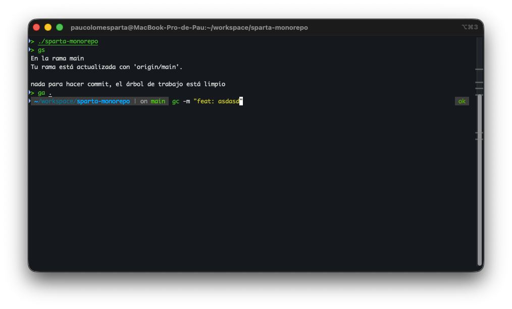

# Dotfiles Config

Personal macOS development environment configuration including:

- **Zsh** with Oh My Zsh + Powerlevel10k theme
- **Neovim** with LazyVim configuration
- **iTerm2** settings
- Modern CLI tools (eza, bat, fd, ripgrep, fzf)

### PW10k

### NVim


## Installation

Follow the step-by-step instructions in [SETUP.md](./SETUP.md).

### One-Liner Install

For a quick setup, run:

```bash
sh -c "$(curl -fsSL https://raw.githubusercontent.com/ohmyzsh/ohmyzsh/master/tools/install.sh)" && \
git clone --depth=1 https://github.com/romkatv/powerlevel10k.git ${ZSH_CUSTOM:-$HOME/.oh-my-zsh/custom}/themes/powerlevel10k && \
git clone https://github.com/zsh-users/zsh-autosuggestions ${ZSH_CUSTOM:-~/.oh-my-zsh/custom}/plugins/zsh-autosuggestions && \
git clone https://github.com/zsh-users/zsh-syntax-highlighting.git ${ZSH_CUSTOM:-~/.oh-my-zsh/custom}/plugins/zsh-syntax-highlighting && \
git clone https://github.com/MichaelAquilina/zsh-you-should-use.git ${ZSH_CUSTOM:-~/.oh-my-zsh/custom}/plugins/you-should-use && \
brew install eza bat fd ripgrep fzf neovim && \
curl -o- https://raw.githubusercontent.com/nvm-sh/nvm/v0.40.1/install.sh | bash && \
cp -r ~/dotfiles/config/nvim ~/.config/nvim
```

Then copy the `.zshrc` from SETUP.md and run `p10k configure`.

### Quick Start

1. Install prerequisites (Homebrew, iTerm2)
2. Run the installation commands from SETUP.md sections 1-6
3. Copy the `.zshrc` configuration
4. Configure Powerlevel10k with `p10k configure`
5. Copy the Neovim config to `~/.config/nvim`
6. Launch `nvim` to auto-install plugins

### What Gets Installed

| Component | Description |
|-----------|-------------|
| Oh My Zsh | Zsh framework with plugins |
| Powerlevel10k | Fast, customizable prompt |
| NVM | Node.js version manager |
| LazyVim | Neovim IDE configuration |
| CLI Tools | eza, bat, fd, ripgrep, fzf |

## Files

- `SETUP.md` - Full installation guide
- `nvim/` - Neovim configuration (copy to `~/.config/nvim`)

## Backup

Before installing, back up existing configs:

```bash
cp ~/.zshrc ~/.zshrc.backup
cp ~/.p10k.zsh ~/.p10k.zsh.backup
mv ~/.config/nvim ~/.config/nvim.backup
```
